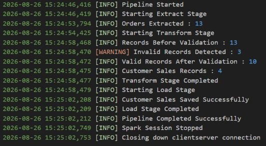
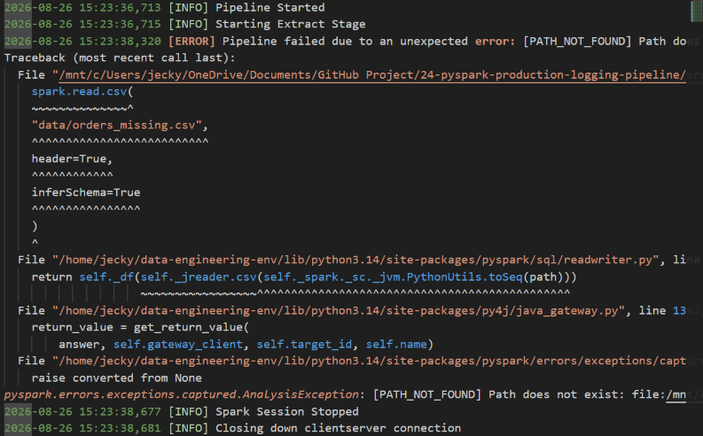

# PySpark Production Logging Pipeline

## Project Overview

A production-oriented PySpark ETL pipeline engineered with Python logging and structured exception handling `(try-except-finally)`. The pipeline provides operational observability across extraction, transformation, validation, and loading stages by recording execution events, data-quality metrics, warnings, and unexpected exceptions to `logs/pipeline.log`. Cleaned customer sales aggregations are persisted in Parquet while Spark resources are safely released through `finally`-based cleanup.

---

## Technologies

- Python 3.14
- Apache Spark 4.2
- PySpark 4.2

---

## Features

- **Production Operational Observability:** Implements Python's `logging` framework to capture pipeline lifecycles, execution timestamps, log levels (`INFO`, `WARNING`, `ERROR`), and stage transitions in `logs/pipeline.log`.

- **Data Validation Auditing:** Tracks pre- and post-validation record counts, dynamically issuing `logger.warning()` alerts whenever invalid rows are filtered out.

- **Exception Handling & Failure Observability:** Wraps ETL workflow execution inside `try-except-finally` blocks to log complete stack traces (`logger.exception()`) upon unexpected runtime failures.

- **Guaranteed Resource Cleanup:** Manages session lifecycles by executing `spark.stop()` within a `finally` block to prevent dangling Spark drivers and resource leaks.

- **Aggregated Parquet Persistence:** Computes customer-level total sales aggregations and writes clean results to `output/customer_sales/` using binary Parquet storage.

---

## Project Structure

```text
24-pyspark-production-logging-pipeline/
├── data/
│   └── orders.csv
├── logs/
│   └── pipeline.log
├── output/
│   └── customer_sales/
├── screenshots/
│   ├── output1.png
│   ├── output2.png
│   ├── output3.png
│   ├── output4.png
│   └── output5.png
├── src/
│   └── main.py
├── .gitignore
├── LICENSE
├── README.md
└── requirements.txt
```

---

## ETL Process

- **Extract**

Configures file-based logging (logs/pipeline.log) with formatted timestamps and log severity levels.
Initializes SparkSession safely within a try block and records pipeline start events.
Ingests raw transactional data from data/orders.csv, logs extracted record totals, and prints raw data.

- **Transform**

Standardizes order_date to DateType and derives total_amount (quantity * unit_price).
Filters out invalid entries (non-positive quantities/prices and null dates).
Calculates data quality metrics by comparing record counts before and after validation.
Emits logger.warning() if invalid records exist; otherwise logs a clean validation state.
Aggregates revenue per customer_id and logs transformation completion.

- **Load**
Writes customer_sales_df to Parquet.
Logs output record counts.
Logs successful completion of the load stage.

- **Resource Cleanup**
Uses finally to execute spark.stop().
Logs Spark session shutdown regardless of pipeline success or failure.

---

## Sample Output

### Successful Pipeline Execution



### Failed Pipeline Execution & Exception Logging



---

## What I Learned

- Configuring Python's logging framework with file output, severity levels, timestamps, and formatted messages.

- Building defensive PySpark pipelines using try-except-finally structures to capture stack traces (logger.exception()).

- Monitoring data quality during transformations by emitting dynamic log warnings based on data validation outcomes.

- Managing Spark driver lifecycles reliably via finally blocks to avoid orphaned sessions.

--- 

## Future Improvements

- Dual Handler Logging: Direct log events simultaneously to both standard output (sys.stdout) and persistent log files (logs/pipeline.log).

- Log Rotation Management: Integrate logging.handlers.RotatingFileHandler to prevent log file bloat in high-frequency production jobs.

- Centralized Monitoring Alerting: Integrate log alerts with Slack webhooks or PagerDuty upon encountering CRITICAL or ERROR log levels.

- Airflow Orchestration Task Integration: Adapt the logging structure to emit standard Airflow TaskInstance logs when deployed under DAG management.

---

## Skills Demonstrated

- Production Engineering & Observability: Python logging, Execution Auditing, Log Level Tuning (INFO, WARNING, ERROR).

- Fault-Tolerant ETL Design: try-except-finally Error Handling, Exception Stack Tracing, Guaranteed Resource Cleanup (spark.stop()).

- PySpark Data Validation: Pre/Post Validation Metrics Audit, Data Quality Checks, Parquet Persistence.

- Failure Handling Test: The failure test confirms that unexpected exceptions are logged with stack traces and that Spark resources are released through the finally block.